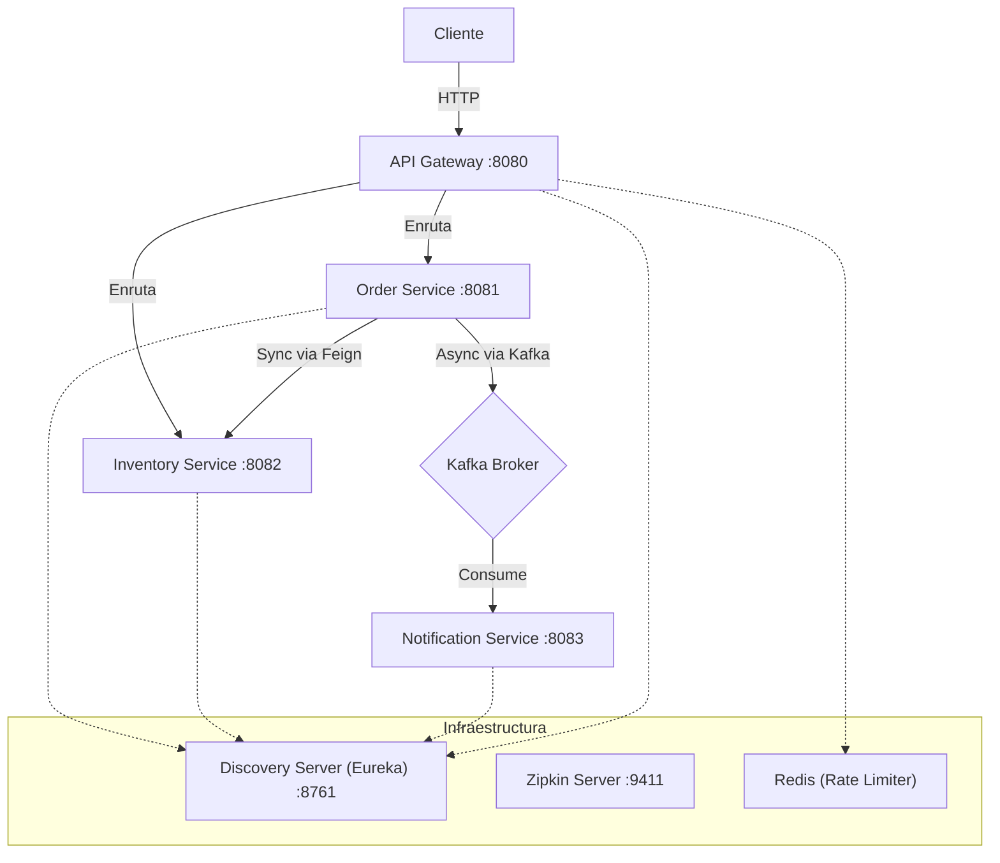

# Microservices Practice

## Introducción
Este proyecto es una implementación práctica y educativa de una arquitectura de microservicios robusta utilizando el ecosistema de Spring Boot. Basado en los conceptos de "The Art of Decoding Microservices", este sistema demuestra patrones esenciales de diseño distribuido, incluyendo descubrimiento de servicios, enrutamiento inteligente, tolerancia a fallos, comunicación asíncrona y observabilidad distribuida.

## Características Principales
- **Descubrimiento de Servicios:** Implementado con Netflix Eureka para el registro y localización dinámica de instancias.
- **API Gateway Centralizado:** Spring Cloud Gateway actúa como punto de entrada único, gestionando el enrutamiento y la seguridad.
- **Rate Limiting:** Protección de endpoints mediante limitación de tasa basada en IP utilizando Redis.
- **Comunicación Síncrona y Asíncrona:** Uso de OpenFeign para llamadas REST directas y Apache Kafka para mensajería basada en eventos.
- **Tolerancia a Fallos (Circuit Breaker):** Implementación de Resilience4j para manejar fallos en cascada y proporcionar mecanismos de fallback.
- **Observabilidad y Trazabilidad:** Integración con Micrometer y Zipkin para el rastreo distribuido de peticiones a través de los microservicios.
- **Infraestructura Dockerizada:** Configuración completa de servicios de soporte (Kafka, Zookeeper, Redis, Zipkin) mediante Docker Compose.

## Arquitectura del Sistema
El sistema sigue una arquitectura de microservicios donde el **API Gateway** enruta las peticiones externas a los servicios correspondientes (**Order Service**, **Inventory Service**).

El **Order Service** verifica el stock comunicándose síncronamente con el **Inventory Service**. Si la orden es exitosa, publica un evento en **Kafka**, el cual es consumido asíncronamente por el **Notification Service**. Todos los servicios se registran en el **Discovery Server** y envían métricas a **Zipkin**.

## Tecnologías Utilizadas
*   **Lenguaje:** Java 17 / 23
*   **Framework Core:** Spring Boot 3.2.3
*   **Nube & Microservicios:** Spring Cloud 2023.0.0 (Eureka, Gateway, OpenFeign, CircuitBreaker)
*   **Mensajería:** Apache Kafka (Spring Kafka)
*   **Base de Datos:** H2 Database (En memoria)
*   **Caché & NoSQL:** Redis
*   **Observabilidad:** Micrometer Tracing, Zipkin
*   **Contenedores:** Docker & Docker Compose
*   **Construcción:** Apache Maven

## Documentación de la API
Los servicios principales son accesibles a través del API Gateway en el puerto `8080`.

### Endpoints Principales:
*   **Realizar Pedido:** `POST http://localhost:8080/api/order`
*   **Verificar Inventario:** `GET http://localhost:8080/api/inventory/{sku-code}`

### Dashboards de Infraestructura:
*   **Eureka (Service Discovery):** http://localhost:8761
*   **Zipkin (Distributed Tracing):** http://localhost:9411